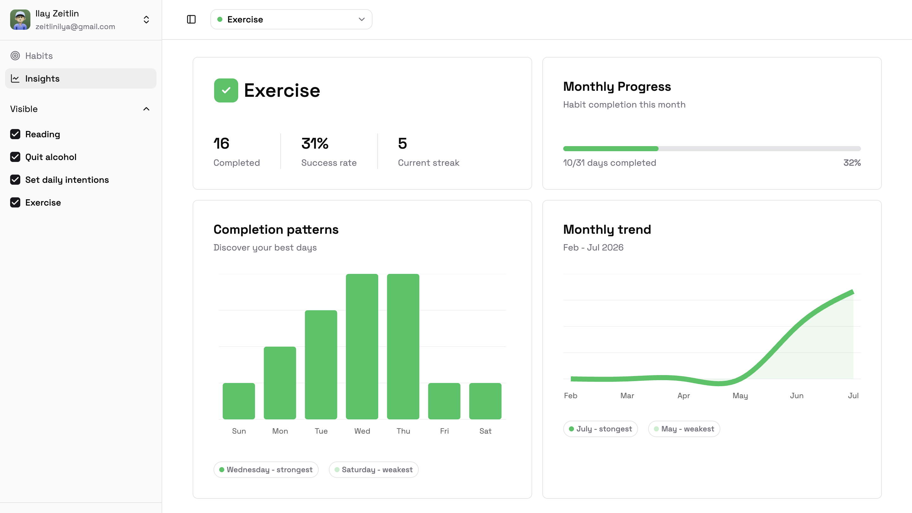
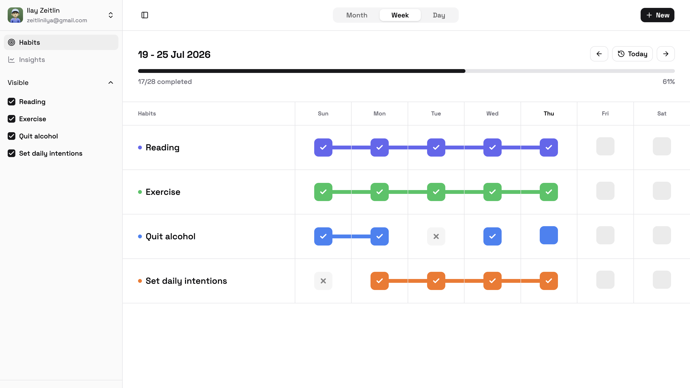
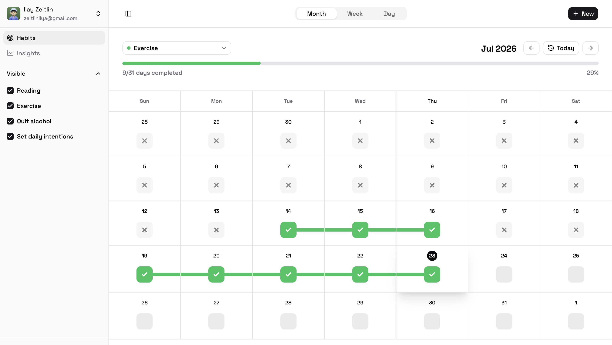
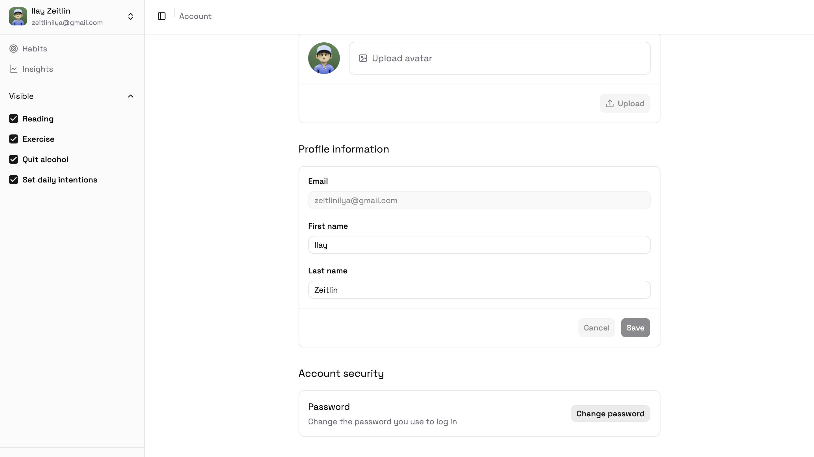

# The Habit Loop — Full Stack Habit Tracker

Full-stack SAAS habit tracking application designed to help users build consistency, track progress, and understand their habits through analytics and insights.

## Overview

Habit Loop allows users to create and manage habits, track daily completion, visualize progress, and discover patterns in their behavior over time.

The goal of the project was to build a complete production-style application with authentication, database management, responsive UI, and real-time user interactions.

## Features

### Authentication

- User signup and login

- Secure authentication using Supabase Auth

- Protected routes

- Password recovery flow

### Habit Management

- Create, update, and delete habits

- Personalize habits with custom colors

- Hide/show habits

- Reorder habits with drag and drop

### Tracking

- Daily, weekly, and monthly habit views

- Mark habits as completed

- Optimistic UI updates

- Calendar-based habit tracking

- Streak tracking

### Insights & Analytics

- Monthly completion progress

- Habit completion rates

- Best and weakest completion days

- Visual charts and statistics

- Habit performance analysis

### User Experience

- Responsive design

- Dark/light/system themes

- Personalized user profiles

- Avatar uploads

- Smooth loading states and error handling

## Tech Stack

### Frontend

- React

- TypeScript

- React Router

- TanStack Query

- React Hook Form

- Zod

- Tailwind CSS

- shadcn/ui

- Recharts

### Backend / Database

- Supabase
  - Authentication

  - PostgreSQL database

  - Storage

  - Row Level Security policies

## Architecture

The application follows a feature-based structure

## Screenshots

### Landing Page

### Habits

### Account

